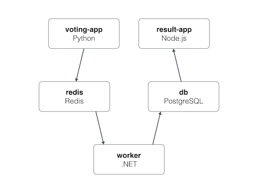
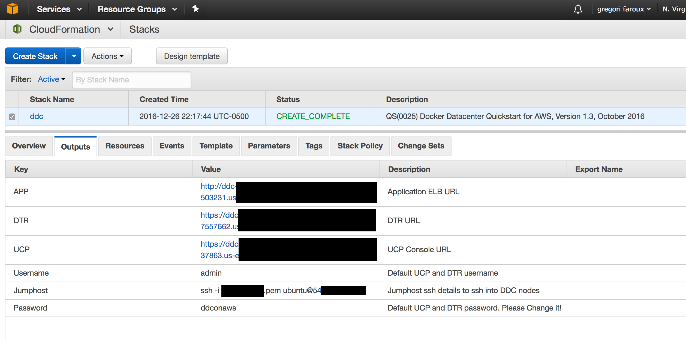
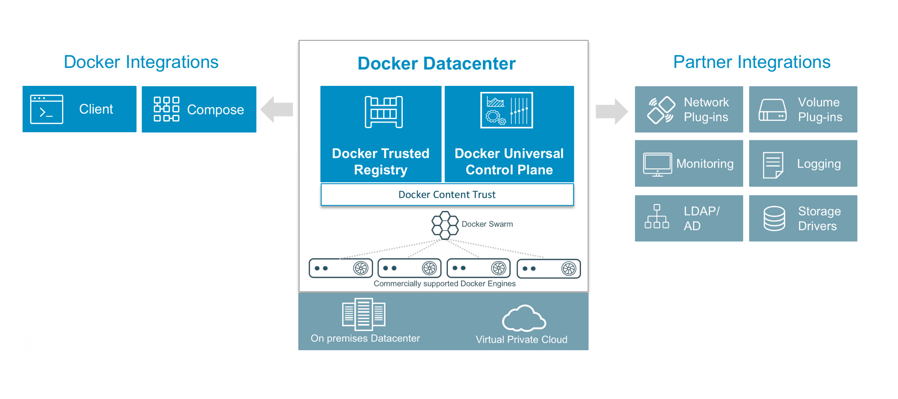
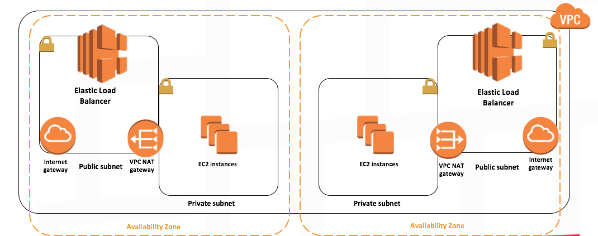

Docker Datacenter & Voting App Example on AWS
=========

# Getting started (Local)
* Download [Docker for Mac or Windows](https://www.docker.com).
* Run in this directory:

```
    $ docker-compose -f docker-compose-local.yml up
```

* The voting app will be running at [http://localhost:5000](http://localhost:5000)
* The results will be at [http://localhost:5001](http://localhost:5001).

## Architecture


* A Python webapp which lets you vote between two options
* A Redis queue which collects new votes
* A Java worker which consumes votes and stores them in…
* A Postgres database backed by a Docker volume
* A Node.js webapp which shows the results of the voting in real time

# Getting Started (AWS)

Deploy of highly-scalable, production-ready Docker Datacenter on AWS based on Docker and AWS best-practices.

Docker Datacenter is an integrated solution including open source and commercial software, the integrations between them, full Docker API support, validated configurations and commercial support for your Docker Datacenter environment. A pluggable architecture allows flexibility in compute, networking and storage providers used in your CaaS infrastructure without disrupting the application code.

## Docker Datacenter on AWS
Before you deploy the Quick Start, you must obtain a trial license for Docker Datacenter.
### 1. Register for a Docker Datacenter Trial License
1. Create a Docker ID at https://hub.docker.com/register/ if you don’t already have one.
2. Open the Docker Datacenter trial page at https://store.docker.com/bundles/dockerdatacenter
and log in with your credentials.
3. In the upper right, choose your Docker ID, and then choose Subscriptions.
4. On the Subscriptions page, you’ll see Docker Datacenter subscription details and a link
to download the license key.
5. Open the license with a text editor and copy the text to the Clipboard. You’ll need this
license during the Quick Start deployment process.

### 2. Prepare an AWS Account
1. If you don’t already have an AWS account, create one at http://aws.amazon.com by
following the on-screen instructions.
2. Use the region selector in the navigation bar to choose the Amazon EC2 region where
you want to deploy Docker Datacenter on AWS.
3. Create a key pair in your preferred region.
4. If necessary, request a service limit increase for the Amazon EC2 M3 instance type. You
might need to do this if you already have an existing deployment that uses this instance
type, and you think you might exceed the default limit with this reference deployment.

### 3. Launch Docker Datacenter

You can launch the Cloudformation template using the AWS Console:
#### AWS Console:
* Click on Launch Stack below. This link will take you to AWS cloudformation portal.
* Confirm your AWS Region that you'd like to launch this stack in ( top right corner)
* Upload the template to Amazon S3 and choose ddc_on_aws.json provided in this repo
* Provide the required parameters ( listed below ) and click Next
** KeyName: Name of an existing EC2 KeyPair to enable SSH access to the instances
** UCPFQDN: Intended FQDN for UCP used to self-sign a cert with domain name.
** UCPControllersInstanceType: AWS EC2 Instance Type for UCP Controllers only. Minimum required is m3.medium
** DTRInstanceType: AWS EC2 Instance Type for DTR Replicas Only. Minimum required is m3.medium
** UCPNodesInstanceType: AWS EC2 Instance Type for UCP nodes
** ClusterSize: Number of UCP nodes (3-64)
** License: Docker Datacenter License (copy+past it in JSON format or URL to download it). You can easily get trial license here
** RootVolumeSize: Root filesystem size in GB. This will be used for all instances ( UCP Controllers, UCP Nodes, and DTR Nodes)
* Confirm and Launch.
* Monitor the status of the stack. When the status is CREATE_COMPLETE, the deployment is complete. Once all done ( it does take between 20-30 mins), click on outputs tab to see the URLs of UCP/DTR/APP ELB, default username and password, and jumphost info
* Log in to the UCP and DTR management consoles by using the links in the Outputs tab.

<p><a href="https://console.aws.amazon.com/cloudformation/home?#/stacks/new?stackName=DockerDatacenter&amp"></a></p>




### 4. Deploy voting app via command line
Docker UCP secures your cluster with role-based access control, so that only authorized users can perform changes to the cluster.

##### 4.1. Download client certificates
1) To download a client certificate bundle, log into the UCP web UI, and navigate to your user profile page.
2) Click the Create a Client Bundle button, to download the certificate bundle.
3) I normally store the client certificate bundle in a folder ucp-bundle-admin in this repo with .gitignore configured to not upload it.

##### 4.2. Use client certificates
```
$ unzip ucp-bundle-admin.zip
$ cd ucp-bundle-admin
$ eval $(<env.sh)
```

##### 4.3 Deploy app

```
$ docker-compose up -d
$ docker-compose ps
```
If any errors, you may need to retry `docker-compose up -d`

The app will be available at http://[Application ELB URL]:5000 and the results at http://[Application ELB URL]:5001

### 5. Configure CNAME (Optionals)
* Configure a CNAME to the APP ELB available in the output of CLoudFoundation
* For insancte, the voting app is: http://www.gregori.site:5000/
* And, the results at: http://www.gregori.site:5001/
* www.gregori.site points to the Application ELB URL found in the Output of the cloudformation (AWS)

## Architecture



Docker Data Center is composed of two main components: Docker Universal Control Plane (UCP) and Docker Trusted Registry (DTR). UCP is an enterprise-grade cluster management solution from Docker that helps you manage your whole cluster from a single place. UCP is made of the UCP controllers and UCP nodes.

DTR is the enterprise-grade image storage solution from Docker that helps you can securely store and manage the Docker images you use in your applications. DTR is made of DTR replicas only that are deployed on UCP nodes.


The AWS Cloudformation starts the installation process by creating all the required AWS resources such as the VPC, security groups, public and private subnets, internet gateways, NAT gateways, and S3 bucket. It then launches the first UCP controller instance and goes through the installation process of Docker engine and UCP containers. It backs the Root CAs created by the first UCP controllers to S3. Once the first UCP controller is up and running, the process of creating the other UCP controllers, the UCP cluster nodes, and the first DTR replica is triggered. Similar to the first UCP controller node, all other nodes are started by installing Docker Commercially Supported engine, followed by running the UCP and DTR containers to join the cluster. Three ELBs, one for UCP, one for DTR and a third for your application, are launched and automatically configured to provide resilient loadbalancing across the two AZs. Additionally, UCP controllers and nodes are launched in an ASG to provide scaling functionality if needed. This architecture ensures that both UCP and DTR instances are spread across both AZs to ensure resiliency and high-availability. UCP worker nodes are launched with �interlock and nginx to dynamically register your deployed applications.


##### Key Functionalities

* Create a New VPC, Private and Public Subnets in different AZs, ELBs, NAT Gateways, Internet Gateways, AutoScaling Groups- all based on AWS best practices
* Creates and configures an S3 bucket for DDC to be used for cert backup and DTR image storage
* Deploys 3 UCP Controllers across multiple AZs within your VPC
* Creates a UCP ELB with preconfigured HTTP healthchecks
* Deploys a scalable cluster of UCP nodes
* Backs up UCP Root CAs to S3
* Create a 3 DTR Replicas across multiple AZs within your VPC
* Creates a DTR with preconfigured healthchecks
* Creates a jumphost ec2 instance to be able to ssh to the DDC nodes
* Creates a UCP Nodes ELB with preconfigured healthchecks (TCP Port 80). This can be used for your application that are deployed on UCP.
* Deploys NGINX+Interlock to dynamically register your application containers. Please see FAQ for more details on launching your application.
* Creates a Cloudwatch Log Group (called DDCLogGroup)and allows log streams from DDC instances. It also automatically logs the UCP and DTR installation * containers.
* Software Versions

EC2 instances use Ubuntu 14.04 LTS AMI
Docker Commercially Supported Engine 1.12
UCP 1.1.4
DTR 2.0.3


Notes and Caveats

UCP and DTR default username and password are admin/ddconaws. PLEASE CHANGE PASSWORD in UCP portal!!. To change the password, go to the UCP portal, under Users and Teams, click on edit button for the admin user. From there you can update the admin account password.
External Certs: Both UCP and DTR are installed with self-signed certs today. If you wish to use your own certs, you can do so by following the UCP and DTR configuration guides. Full UCP and DTR Configuration guides are found here and here.
A Single Security Group is used in this setup. The security group only allows HTTP,HTTPS, and SSH traffic from external IPs. Security group doesn't limit any traffic from within the cluster. Please adjust it as needed.
SSH: If you need to SSH into the cluster you can do so by using SSH agent forwarding and ssh'ing into the jumphost node using the selected private key. Once you're logged into the jumphost, you can use the private IP address of any of the other nodes to ssh into them.
Default username for ubuntu based AMI's is ubuntu.
S
